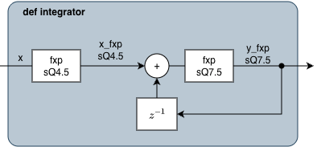
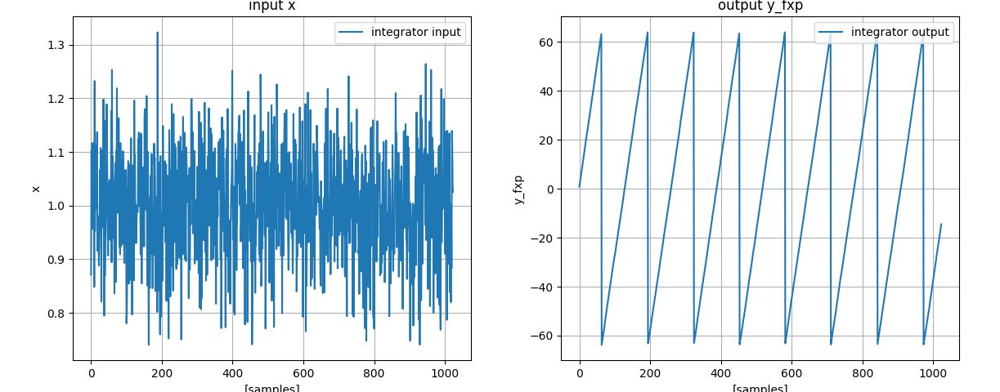

# Simple fixed-point integrator

The goal is to implement the fixed-point integrator of this block diagram:




The `ovf` and `rnd` arguments of the `Q` function expect
integers as inputs. For convenience, constants can be imported from the `pyfxp.constants`
module and used as arguments. Below, the `SAT` and `TRUNC` and `WRAP` constants are imported.

```python
import matplotlib.pyplot as plt
import numpy as np

from pyfxp import FxpSpec, Q, fxp
from pyfxp.constants import SAT, TRUNC, WRAP
```


We will start by implementing the integrator as a function. The integrator receives
two specs:

- `spec_input`: fixed-point specification for the input of the integrator.
- `spec_output`: fixed-point specification for the output of the integrator.

```python

def integrator(x: np.ndarray, spec_input: FxpSpec, spec_output: FxpSpec) -> np.ndarray:
    """Example of a simple fixed-point integrator."""
    len_x = len(x)

    # convert float input to sQ4.5 and saturation
    # fxp accepts receiving numpy arrays
    x_fxp = fxp(x, spec_input)

    # implement accumulator
    acc = 0
    y_fxp = np.zeros(len_x)
    for i in range(len_x):
        y_fxp[i] = fxp(acc + x_fxp[i], spec_output)
        acc = y_fxp[i]

    return y_fxp
```

The fixed-point specifications are created using the `Q` function. The first spec is used
to convert the input of the integrator to `sQ4.5`. The second spec `sQ7.5` is used for the integrator
output.

The input stimulus `x` will be a DC signal with value of 1 with some additive normal noise.
Note that an integrator has infinite gain at DC, and it is expected to overflow for a DC signal.


```python
# Create fixed-point specifications
sQ4_5 = Q(4, 5, rnd=TRUNC, ovf=SAT)
sQ7_5 = Q(7, 5, rnd=TRUNC, ovf=WRAP)

# number of samples used for the simulation
n_smp = 1024

# DC value + normal noise
x = np.ones(n_smp) + np.random.normal(0, 0.1, n_smp)
y_fxp = integrator(x, spec_input=sQ4_5, spec_output=sQ7_5)
```

Plotting the output shows that the integrator overflows, as expected.

```python
fig, ax = plt.subplots(1, 2)
fig.tight_layout()

ax[0].plot(x, label="integrator input")
ax[0].set_ylabel("x")
ax[0].set_xlabel("[samples]")
ax[0].set_title("input x")
ax[0].legend()
ax[0].grid()

ax[1].plot(y_fxp, label="integrator output")
ax[1].set_xlabel("[samples]")
ax[1].set_ylabel("y_fxp")
ax[1].set_title("output y_fxp")
ax[1].legend()
ax[1].grid()
plt.show()
```



